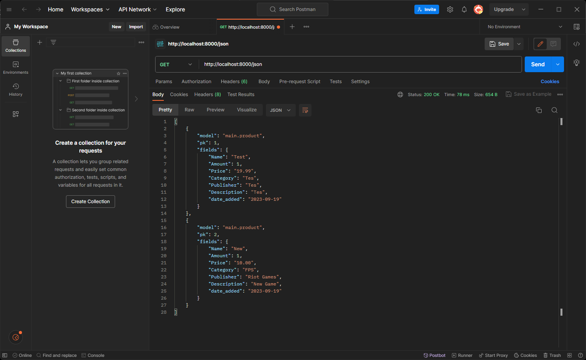

# Tugas 2
## 1.  Jelaskan bagaimana cara kamu mengimplementasikan checklist di atas secara step-by-step (bukan hanya sekadar mengikuti tutorial).
1. Menginstall env dengan python.
2. Menginstall dependencies.
3. Membuat aplikasi baru dan mendaftarkan ke dalam `settings.py`.
4. Membuat template dasar menggunakan html.
5. Membuat implementasi di `models.py`.
6. Membuat implementasi di `views.py`.
7. Mengonfiguarsi routing URL di `urls.py` direktori aplikasi main dan routing URL di `urls.py`di direktori utama.
## 2. Buatlah bagan yang berisi request client ke web aplikasi berbasis Django beserta responnya dan jelaskan pada bagan tersebut kaitan antara *`urls.py`*, *`views.py`*, *`models.py`*, dan berkas html.
<br>


<br>
Client akan request ke `urls.py`. Lalu, `urls.py`akan memilih view dari `views.py`. Setelah itu, `views.py` akan mengirimkan query ke `models.py` dan mengembalikan data. Selanjutnya akan memilih berkas HTML dan HTML akan menampilkan halaman web kembali ke client.

## 3. Jelaskan mengapa kita menggunakan virtual environment? Apakah kita tetap dapat membuat aplikasi web berbasis Django tanpa menggunakan virtual environment? 
- Virtual environment digunakan untuk mengisolasi package serta dependencies dari aplikasi sehingga tidak bertabrakan dengan versi lain yang ada pada komputer local. 
- Kita bisa membuat aplikasi web berbasis Django tanpa menggunakan virtual environment hanya kita tidak dapat mengisolasi project untuk mencegah terjadinya konfilk antar project.

## 4. Jelaskan apakah itu MVC, MVT, MVVM dan perbedaan dari ketiganya.
- Model View Controller (MVC) adalah sebuah metode untuk membuat sebuah aplikasi dengan memisahkan data (Model) dari tampilan (View) dan cara bagaimana memprosesnya (Controller)
- Model View Template (MVT) adalah sebuah konsep arsitektur yang digunakan dalam pengembangan web untuk memisahkan komponen-komponen utama dari sebuah aplikasi. 
- Model View ViewModel (MVVM) adalah salah satu arsitektur pembuatan aplikasi berbasis GUI yang berfokus pada pemisahan antara kode untuk logika bisnis dan tampilan aplikasi.
___

<br>

# Tugas 3
## 1. Apa perbedaan antara form POST dan form GET dalam Django?
### Form Post:
- Form POST adalah method yang digunakan untuk mengirimkan data pada web seperti input text ataupun radio button.
- Data yang dikirim melalui HTTP request adalah data berupa teks biasa (text).
- Dengan cara ini, data tersebut tidak bisa disimpan oleh browser secara langsung tanpa menambah proses penyambungan untuk memodifikasinya.
- Jika ingin membuka halaman lainnya atau menuju ke URL lain, harus mengirimkannya via method post.
- Dalam pengiriman data tersebut tidak ada batasan ukuran atau jumlahnya.
- Pengguna bisa melihat isi dari setiap field pada halaman web.
- Biasanya digunakan untuk menyimpan informasi seperti username/password, nama user dll.
- jika pembuatan berhasil, maka akan mengembalikan HTTP status code 201
### Form Get:
- Form GET adalah method yang digunakan untuk mendapatkan data pada web. 
- Form GET mengembalikan HTTP status code 200 (OK) jika data berhasil diambil dari server.
- Data yang dikirimkan melalui HTTP request merupakan parameter url.
- Parameter ini akan disertai oleh tanda ? dan dilanjutkan dengan key=value&key=value.
- Digunakan untuk membaca data saja tanpa memperbarui database.

## 2. Apa perbedaan utama antara XML, JSON, dan HTML dalam konteks pengiriman data?
| |XML|JSON|HTML|
|-|-|-|-|
|**Format**|Textual|Textual|Markup Language|
|**Data Type**|Terstruktur|Tidak Terstruktur|Tidak Terstruktur|
|**Structure**|Hierarchical|Flat|Tree Structure|
|**Size**|Besar|Kecil|Sedang|
|**Speed of Transmission**|Lambat|Cepat|Sangat Cepat|
|**Usage**|Web Services|APIs|Web Pages|
## 3. Mengapa JSON sering digunakan dalam pertukaran data antara aplikasi web modern?
- Formatnya sangat sederhana sehingga prosesnya sangat cepat.
- Format tersebut juga bisa diproses oleh komputer tanpa harus mendeklarasikannya .
- Kita tidak perlu membuat class baru untuk menerima atau memanipulasi data dari API terkait.
- Pembuatan data JSON dapat ditulis dalam bahasa pemrograman apapun.
## 4. Jelaskan bagaimana cara kamu mengimplementasikan checklist di atas secara step-by-step (bukan hanya sekadar mengikuti tutorial).
1. membuat input fields form di `forms.py`.
2. membuat function-function baru untuk menampilkan di `views.py`

`create_product`:
```python 
def create_product(request):
    form = ProductForm(request.POST or None)

    if form.is_valid() and request.method == "POST":
        form.save()
        return HttpResponseRedirect(reverse('main:show_main'))

    context = {'form': form}
    return render(request, "create_product.html", context)
```
`XML`:
```python
def show_xml(request):
    data = Product.objects.all()
    return HttpResponse(serializers.serialize("xml", data), content_type="application/xml")
```

`JSON`:
```python
def show_json(request):
    data = Product.objects.all()
    return HttpResponse(serializers.serialize("json", data), content_type="application/json")
``` 
`XML by ID`:
```python
def show_xml_by_id(request):
    data = Product.objects.all()
    return HttpResponse(serializers.serialize("xml", data), content_type="application/xml")
```
`JSON by ID`:
```python
def show_json_by_id(request):
    data = Product.objects.all()
    return HttpResponse(serializers.serialize("json", data), content_type="application/json")
```
3. meng-import function-function dari `views.py` ke `urls.py`
4. membuat path baru di urls.py untuk memanggil fungsi di `views.py`.
```python
...
path('create-product', create_product, name='create_product'),
path('xml/',show_xml,name='show_xml'),
path('json/',show_json,name='show_json'),
path('xml/<int:id>/', show_xml_by_id, name='show_xml_by_id'),
path('json/<int:id>/', show_json_by_id, name='show_json_by_id')
...
```

# Tugas 4
## 1. Apa itu Django UserCreationForm, dan jelaskan apa kelebihan dan kekurangannya?
Django UserCreationForm adalah untuk membuat user baru yang dapat digunakan dengan membuat form pendaftaran pengguna 
Kelebihan Django UserCreationForm:

- Mudah digunakan dan integrasi dengan Django
- Otomatis melakukan validasi data
- Menggunakan password hashing untuk menjaga keamanan data pengguna

Kekurangan Django UserCreationForm:

- Hanya menangani beberapa field yang penting, seperti username, email, dan password
- Tidak menangani beberapa fitur tambahan yang mungkin diperlukan, seperti konfirmasi email atau pengaturan profil pengguna

## 2. Apa perbedaan antara autentikasi dan otorisasi dalam konteks Django, dan mengapa keduanya penting?
Autentikasi adalah proses pencocokan identitas user (username ataupun email). Jika ada match maka akan dilanj
utkan login user tersebut. Sedangkan otorisasi merujuk pada akses menu dan fitur aplikasi berdasarkan hak akses user saat ini. 

## 3. Apa itu cookies dalam konteks aplikasi web, dan bagaimana Django menggunakan cookies untuk mengelola data sesi pengguna?
Cookies dalam konteks aplikasi web adalah kumpulan data kecil yang disimpan di peramban pengguna. Cookies digunakan untuk berbagai tujuan, seperti mengingat preferensi pengguna, menyimpan data login, atau mengidentifikasi pengguna yang telah mengunjungi situs web sebelumnya.

Django menggunakan cookies untuk mengelola data sesi pengguna. Sesi adalah cara untuk menyimpan informasi tentang pengguna yang sedang mengakses aplikasi web. Informasi ini dapat digunakan untuk berbagai tujuan, seperti mengingat preferensi pengguna atau menyimpan data login.

Django menggunakan middleware untuk mengelola cookies. Middleware adalah komponen yang dapat dimasukkan ke dalam proses request-response Django untuk menambahkan atau mengubah fungsi. Middleware cookies mengatur pembuatan, pengiriman, dan penerimaan cookies.
## 4. Apakah penggunaan cookies aman secara default dalam pengembangan web, atau apakah ada risiko potensial yang harus diwaspadai?

Manfaat Cookies:

Cookies memungkinkan aplikasi web untuk mengingat status pengguna dan menyimpan informasi penting seperti preferensi pengguna, data login, dan item dalam keranjang belanja.
Cookies juga memungkinkan pelacakan perilaku pengguna, yang dapat digunakan untuk personalisasi dan analisis.

Risiko Cookies:

Meskipun cookies sendiri cukup aman dan tidak dapat menyebar virus atau malware, mereka dapat menimbulkan beberapa masalah privasi dan keamanan jika tidak ditangani dengan benar.
Misalnya, cookies dapat digunakan untuk melacak aktivitas web pengguna, yang dapat menimbulkan masalah privasi.
Jika cookies tidak ditangani dengan benar, mereka dapat menjadi target manipulasi dan penyalahgunaan. Misalnya, supercookie dan zombie cookie dapat menimbulkan masalah keamanan.
Cookies juga dapat memperburuk kinerja, terutama untuk koneksi data seluler, karena mereka dikirim dengan setiap permintaan.

## 5. Jelaskan bagaimana cara kamu mengimplementasikan checklist di atas secara step-by-step (bukan hanya sekadar mengikuti tutorial).
1. Menambahkan models baru di `models.py` untuk user.
2. Menambahkan function-function untuk register login user dan logout user di `views.py`.
3. menambahkan urls untuk menampilkan function function untuk register login user dan logout user
4. menambahkan file template `login.html` dan `register.html`.

Bonus:

5. Mengimplementasikan function `update_amount` untuk menambahkan amount untuk item.
6. Menambahkan button di `maint.html` untuk menambahkan dan mengurangi amount untuk game dengan function `update_amount`
7. Membuat path baru untuk `update-amount` dengan parameter `productid`
<br/>
# Tugas 5
##  Jelaskan manfaat dari setiap element selector dan kapan waktu yang tepat untuk menggunakannya.

Element selector memungkinkan untuk memilih elemen HTML berdasarkan nama elemennya. Ini adalah selector paling dasar dalam CSS dan digunakan untuk menerapkan style ke semua elemen dengan nama yang sesuai.
Element selector berguna ketika ingin menerapkan gaya umum ke semua elemen dengan nama yang sama, seperti mengubah gaya teks untuk semua `<p>` dalam dokumen HTML.
## Jelaskan HTML5 Tag yang kamu ketahui.
- head: Tag `<head>` digunakan untuk menyediakan informasi meta-data mengenai dokumen HTML, seperti judul halaman, tautan ke file CSS, dan lainnya.

- body: Tag `<body>` berisi konten utama dari dokumen HTML, seperti teks, gambar, elemen-elemen HTML lainnya, dan tampilan halaman yang akan ditampilkan kepada pengguna.

- footer: Tag `<footer>` digunakan untuk menandai bagian akhir dari sebuah elemen atau dokumen HTML. Biasanya, digunakan untuk informasi penutup atau hak cipta.

- button: Tag `<button>` digunakan untuk membuat tombol yang dapat diklik oleh pengguna. Ini sering digunakan dalam formulir atau untuk memicu tindakan JavaScript.

- table: Tag `<table>` digunakan untuk membuat tabel dalam dokumen HTML.

- tr: Tag `<tr>` digunakan dalam tabel untuk mendefinisikan baris.

- td: Tag `<td>` digunakan dalam tabel untuk mendefinisikan sel (cell) data.

- th: Tag `<th>` digunakan dalam tabel untuk mendefinisikan sel header (kolom).

- div: Tag `<div>` digunakan untuk mengelompokkan elemen-elemen HTML dan memungkinkan Anda untuk mengatur gaya atau merancang tampilan.

- em: Tag `<em>` digunakan untuk menekankan teks, biasanya dengan memberikan penekanan visual seperti huruf miring.

- form: Tag `<form>` digunakan untuk membuat formulir yang mengumpulkan data dari pengguna.

- span: Tag `<span>` digunakan untuk mengelompokkan elemen-elemen teks atau elemen dalam dokumen dan biasanya tidak mengubah tampilan atau gaya mereka secara signifikan.

- strong: Tag `<strong>` digunakan untuk menandai teks yang penting atau memiliki penekanan yang lebih kuat daripada teks biasa.

- title: Tag `<title>` digunakan dalam elemen `<head>` untuk menentukan judul halaman web yang akan ditampilkan di tab peramban.

- nav: Tag `<nav>` digunakan untuk mengelompokkan tautan navigasi pada situs web.

- ul: Tag `<ul>` digunakan untuk membuat daftar tak-terurut (unordered list).

- li: Tag `<li>` digunakan dalam daftar tak-terurut atau terurut untuk mendefinisikan item dalam daftar.

- ol: Tag `<ol>` digunakan untuk membuat daftar terurut (ordered list).

- img: Tag `` digunakan untuk menampilkan gambar dalam halaman web.

- a: Tag `<a>` digunakan untuk membuat tautan (link) ke halaman lain atau sumber eksternal.

- input: Tag `<input>` digunakan dalam formulir HTML untuk menerima input dari pengguna, seperti teks, kata sandi, atau kotak centang.

- label: Tag `<label>` digunakan untuk memberikan label atau keterangan untuk elemen formulir, yang membantu pengguna memahami tujuan elemen tersebut.

## Jelaskan perbedaan antara margin dan padding.
Perbedaan antara Margin dan Padding:

- Margin: Margin adalah ruang di sekitar elemen HTML. Ini adalah jarak antara elemen tersebut dan elemen-elemen lain di sekitarnya. Margin tidak memiliki latar belakang atau warna dan mengontrol jarak antara elemen dan elemen-elemen lainnya.
- Padding: Padding adalah ruang di dalam elemen HTML, di antara konten elemen dan batas elemen tersebut. Padding mengontrol jarak antara konten elemen dan batas elemen itu sendiri. Padding dapat memiliki latar belakang atau warna.
## Jelaskan perbedaan antara framework CSS Tailwind dan Bootstrap. Kapan sebaiknya kita menggunakan Bootstrap daripada Tailwind, dan sebaliknya?
Tailwind CSS:

- Manfaat: Tailwind CSS adalah framework CSS utility-first yang memberikan fleksibilitas tinggi dalam membangun tata letak dan komponen. Ini memungkinkan pengembang untuk membuat desain yang sangat kustomisasi dengan menggabungkan kelas-kelas utilitas.
- Waktu yang Tepat: Tailwind cocok digunakan jika ingin desain yang sangat kustom dan siap menghabiskan waktu dalam menentukan kelas-kelas utilitas yang sesuai.

Bootstrap:

- Manfaat: Bootstrap adalah framework CSS yang siap pakai dengan sejumlah besar komponen dan gaya pra-didefinisikan. Ini memungkinkan pengembangan cepat dan desain yang konsisten.
- Waktu yang Tepat: Bootstrap sangat cocok jika ingin membangun situs web dengan cepat tanpa perlu merancang banyak gaya atau komponen dari awal. Ini juga berguna dalam pengembangan web responsif.

Kapan Menggunakan Bootstrap atau Tailwind:

- Bootstrap: Jika ingin membangun situs dengan cepat, tidak memiliki banyak pengalaman dalam desain web. Framework Bootstrap hanya dengan mematuhi konvensi desain Bootstrap. Ini juga cocok untuk proyek dengan batas waktu yang ketat.
- Tailwind CSS: Jika ingin memiliki kendali penuh atas desain, memiliki pengalaman desain web yang lebih besar, dan ingin membuat tata letak yang sangat kustomisasi. Tailwind cocok untuk proyek-proyek yang membutuhkan desain unik dan memiliki waktu untuk menyesuaikan setiap detail desain.
## Jelaskan bagaimana cara kamu mengimplementasikan checklist di atas secara step-by-step (bukan hanya sekadar mengikuti tutorial).
1. Menambahkan function edit_product untuk mengubah data item yang ada dan delete_product untuk menghapus item yang ada.
2. Menambahkan path di `urls.py` untuk 2 function tersebut.
3. Membuat file html baru untuk edit_product.
4. Menambahkan framework bootstrap di base.html.
5. Memanggil file cssnya di base.html.
6. Menambahkan navbar di main
7. Mengubah tabel yang ada di main dengan menggunakan class Card (card) dari bootstrap untuk menampilkan item yang ada di database.
8. Dengan menggunakan card, saya membuat header untuk nama item, body untuk data-data lainnya, dan footer untuk tanggal masukknya data.
9. Mengubah button yang ada di main dengan menggunkan class Button (btn) dari bootstrap.

# Tugas 6
http://clarence-grady-tugas.pbp.cs.ui.ac.id/
## 1. Jelaskan perbedaan antara asynchronous programming dengan synchronous programming.
- Synchronous programming adalah proses yang berjalan secara berurutan, satu per satu. Jika ada proses yang membutuhkan waktu lama, maka proses lainnya harus menunggu hingga proses tersebut selesai.
- Asynchronous programming adalah proses yang berjalan secara bersamaan. Jika ada proses yang membutuhkan waktu lama, maka proses lainnya tidak perlu menunggu hingga proses tersebut selesai.
## 2. Dalam penerapan JavaScript dan AJAX, terdapat penerapan paradigma event-driven programming. Jelaskan maksud dari paradigma tersebut dan sebutkan salah satu contoh penerapannya pada tugas ini.
- Event-driven programming adalah proses yang berjalan berdasarkan event yang terjadi. Jika ada event yang terjadi, maka proses akan dijalankan.
- Contoh penerapannya pada tugas ini adalah ketika user mengklik tombol edit, maka akan muncul form edit dan ketika user mengklik tombol delete, maka product akan terhapus.
## 3. Jelaskan penerapan asynchronous programming pada AJAX.
- AJAX menggunakan asynchronous programming untuk mengirim dan menerima data dari server tanpa harus memuat ulang halaman web.
- AJAX menggunakan XMLHttpRequest (XHR) untuk mengirim dan menerima data dari server.
## 4. Pada PBP kali ini, penerapan AJAX dilakukan dengan menggunakan Fetch API daripada library jQuery. Bandingkanlah kedua teknologi tersebut dan tuliskan pendapat kamu teknologi manakah yang lebih baik untuk digunakan.
Fetch API adalah API JavaScript bawaan yang menyediakan antarmuka untuk mengambil dan mengirim permintaan HTTP. 

Kelebihan dari Fetch API adalah:

- Lebih ringan dan cepat daripada jQuery karena tidak memerlukan library tambahan.
- Lebih modern dan mendukung fitur terbaru seperti Promise dan async/await.
- Lebih mudah digunakan dan memiliki sintaks yang lebih sederhana.

Kekurangan dari Fetch API adalah:

- Tidak mendukung fitur cross-domain request pada browser lama.
- Tidak memiliki dukungan untuk fitur tertentu seperti JSONP dan timeout.

jQuery adalah library JavaScript yang menyediakan antarmuka yang mudah digunakan untuk berinteraksi dengan DOM, membuat animasi, dan mengirim permintaan HTTP. 

Kelebihan dari jQuery adalah:

- Mendukung fitur cross-domain request pada browser lama dengan menggunakan teknik JSONP.
- Memiliki dukungan untuk fitur tertentu seperti timeout dan cache control.

Kekurangan dari jQuery adalah:

- Lebih berat dan lambat daripada Fetch API karena memuat library tambahan.
- Lebih kuno dan tidak mendukung fitur terbaru seperti Promise dan async/await.

Dalam konteks pengembangan web modern, Fetch API lebih baik karena lebih ringan, cepat, dan modern. Namun, jika perlu mendukung browser lama atau membutuhkan fitur tertentu seperti JSONP atau timeout, maka jQuery bisa menjadi pilihan yang lebih baik.

## 5. Jelaskan bagaimana cara kamu mengimplementasikan checklist di atas secara step-by-step (bukan hanya sekadar mengikuti tutorial).
1. Menambahkan function `create_product_ajax` untuk menambahkan item baru dengan menggunakan ajax, `edit_product_ajax` untuk mengubah data item yang ada dengan ajax dan `delete_product_ajax` untuk menghapus item yang ada dengan ajax.
2. Menambahkan path di `urls.py` untuk 3 function tersebut.
3. Membuat function dan async function di `main.html` agar dapat merefresh card secara otomatis.
4. Menambahkan modal di `main.html` untuk menampilkan form add product dan edit product.